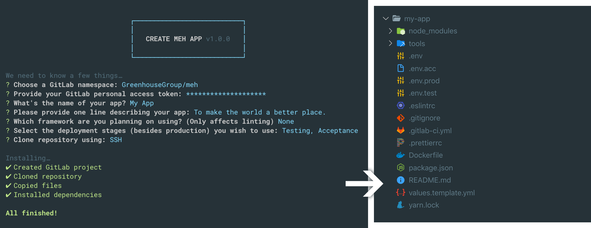

# Create MEH App

> Quickly scaffolds a new MEH project by setting up linting, formatting and automatic deployment.

## Usage

```shell
yarn create meh-app <app-name>
```

#### Examples

- `yarn create meh-app my-app`
- `yarn create meh-app folder/my-app`
- `yarn create meh-app /folder/my-app`



## Features

- [x] Lints & formats `.js(x)`, `.ts(x)`, and `.vue`
- [x] Formats `.graphql`, `.html`, `.json`, `.md`, `.(s)css`, and `.yml`
- [x] Creates & clones a GitLab repository
- [x] Initial commits on `master` and `develop`
- [x] Automatic `.env.<stage>` secrets deployment
- [x] Automatic Kubernetes deployment
- [x] Automatic Airflow DAG(s) deployment

## Prerequisites

- [Yarn](https://yarnpkg.com/)
- [Kubectl v1.11.5](https://storage.googleapis.com/kubernetes-release/release/v1.11.5/bin/darwin/amd64/kubectl)
- GitLab [personal access token](https://gitlab.com/profile/personal_access_tokens) (`api` scoped)

## Git hooks

#### Pre-commit

- Lints and formats, and attempts to autofix your staged (`.js(x)`, `.ts(x)`, and `.vue`) files through [ESLint](https://eslint.org/) (extending [Airbnb](https://github.com/airbnb/javascript#readme) and [Prettier](https://prettier.io/))
- Formats and attempts to autoformat your staged (`.graphql`, `.html`, `.json`, `.md`, `.(s)css`, and `.yml`) files through Prettier

#### Pre-push

- Runs `yarn test`
- When on `master` branch: Applies your `.env.prod`\* through `kubectl`
- When on `develop` branch: Applies your `.env.acc`\* through `kubectl`
- On other branches: Applies your `.env.test`\* through `kubectl`

_\*if file exists_

## Airflow DAGs

If you opted in for Airflow DAG(s) during setup, the following will be added:

- `/dags/<dagName>.py` (containing the interval and description you entered)
- `start:<dagName>` script in `package.json` (the Airflow pod will call `yarn start:<dagName>`)
- `deploy_dags` script in `.gitlab-ci.yml` (this will deploy any `*.py` files in `/dags` when pushing to `master`)

## Recommended Visual Studio Code settings

#### Extensions

- [ESLint](https://marketplace.visualstudio.com/items?itemName=dbaeumer.vscode-eslint)
- [Prettier - Code formatter](https://marketplace.visualstudio.com/items?itemName=esbenp.prettier-vscode)

#### settings.json

```json
{
  "editor.formatOnSave": true,
  "eslint.autoFixOnSave": true,
  "eslint.validate": [
    "javascript",
    "javascriptreact",
    {
      "language": "typescript",
      "autoFix": true
    },
    {
      "language": "typescriptreact",
      "autoFix": true
    },
    {
      "language": "vue",
      "autoFix": true
    }
  ],
  "prettier.disableLanguages": [
    "javascript",
    "javascriptreact",
    "typescript",
    "typescriptreact",
    "vue"
  ]
}
```

We disable Prettier from formatting JS(X), TS(X), and Vue files, to prevent conflicts, because ESLint already formats these (using Prettier under the hood).

## Roadmap

- [ ] Reduce amount of `devDependencies`
